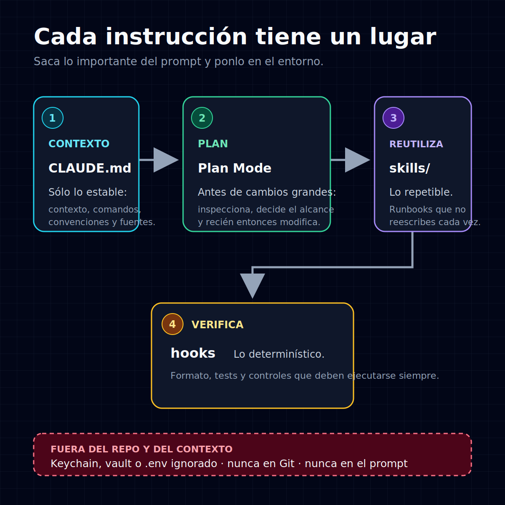

# claude-kit

**Kit de arranque en español para configurar Claude Code en tus repos** — código o
datos. El objetivo: que Claude sea confiable, reproducible y seguro **sin llenar el
prompt de instrucciones**.

La lección detrás del kit: fui agregando contexto, reglas y excepciones a mi setup
hasta que se volvió más difícil de entender, no más fácil — más instrucciones no
hacían a Claude más confiable, lo hacían más confuso. Lo que arregló el problema no
fue escribir más, sino **decidir qué pertenece a cada capa**: el contexto estable en
`CLAUDE.md`, los procedimientos repetibles en skills, la validación determinística en
hooks y los secretos fuera del contexto del modelo.

## La idea en un diagrama



```
claude-kit/
├── README.md                    ← empieza aquí
├── assets/
│   └── claude-kit-structure.svg ← diagrama embebido y reutilizable
├── templates/
│   ├── CLAUDE.md                ← contexto estable del proyecto (cópialo a tu repo)
│   ├── settings.json            ← deny para archivos sensibles comunes
│   └── example-skill/SKILL.md   ← una skill mínima de ejemplo
└── docs/
    ├── security.md              ← defensa en profundidad para secretos
    └── advanced.md              ← capa global, skills globales, agents, MCP, equipo
```

## Las reglas

1. **`CLAUDE.md` = solo lo estable.** Qué es el proyecto, comandos, arquitectura,
   convenciones, fuentes de verdad. No lo conviertas en un volcado de instrucciones.
2. **Plan Mode antes de cambios grandes.** Multi-file, refactors o algo desordenado:
   deja que Claude inspeccione antes de tocar código. Entra con `Shift+Tab` dos veces
   o inicia la sesión con `claude --permission-mode plan`.
3. **Lo repetible → skills.** Si tecleas seguido "review this" o "prepara esto para
   deploy", conviértelo en un runbook reutilizable en vez de reescribirlo cada vez.
4. **Lo determinístico → hooks.** Formato, tests, validación, guardrails: lo que debe
   pasar **siempre** lo maneja el sistema, no la memoria del modelo.
5. **Secretos fuera del repo y del contexto.** Prefiere keychain o un gestor de
   secretos; usa `.env` sólo como alternativa local ignorada. No los imprimas ni los
   pases como argumentos. El `deny` es una red adicional — ver [docs/security.md](docs/security.md).

## Quick start (menos de 15 min)

1. Clona el kit y guarda su ruta:
   ```bash
   git clone https://github.com/ronaldmego/claude-kit.git
   cd claude-kit && KIT="$PWD"
   ```
2. Entra a tu proyecto y copia el starter. Si esos archivos ya existen, integra los
   cambios manualmente en vez de sobrescribirlos:
   ```bash
   cd /ruta/a/tu-proyecto
   mkdir -p .claude/skills/revisar-diff
   test -e CLAUDE.md || cp "$KIT/templates/CLAUDE.md" ./CLAUDE.md
   test -e .claude/settings.json || cp "$KIT/templates/settings.json" .claude/settings.json
   test -e .claude/skills/revisar-diff/SKILL.md || \
     cp "$KIT/templates/example-skill/SKILL.md" .claude/skills/revisar-diff/SKILL.md
   ```
3. Rellena los `[placeholders]` de `CLAUDE.md` y borra lo que no aplique. **Sólo lo
   estable.** Confirma que tu `.gitignore` excluye `.env`, `.env.*` y `secrets/`, pero
   permite `!.env.example`. La skill es opcional; elimínala si no la necesitas.
4. Abre Claude Code, confirma que entiende el proyecto y usa Plan Mode antes de un
   cambio grande (`Shift+Tab` dos veces o `claude --permission-mode plan`).

## Qué hay aquí

- **Plantillas** listas para copiar: [`CLAUDE.md`](templates/CLAUDE.md) ·
  [`settings.json`](templates/settings.json) ·
  [`example-skill/SKILL.md`](templates/example-skill/SKILL.md).
- **[docs/security.md](docs/security.md)** — defensa en profundidad para secretos:
  qué bloquea (y qué no) el `deny`, consumir secretos sin imprimirlos, cuándo usar
  hooks y aprobación humana en lo irreversible.
- **[docs/advanced.md](docs/advanced.md)** — capa opcional cuando ya tienes rodaje:
  `CLAUDE.md` global, skills globales, subagents, MCP y trabajo en equipo.

## Alcance

Es un **kit personal de arranque**, no una arquitectura enterprise ni una enciclopedia
de Claude. Reúne lo mínimo verificado para que un proyecto sea confiable y seguro. Las
fuentes normativas son los [docs oficiales de Claude Code](https://code.claude.com/docs);
este kit solo te ahorra las primeras decisiones.

## Licencia

MIT — ver [LICENSE](LICENSE).
